## A talk about
#### VM, IR (AST, CFG, SSA, VDG, CPS), DCE, LICM, GCM, GVN, JSC (DFG, FTL), LLVM...
### or
## Intro to the Optimizing Compilers

----

#### Ingvar Stepanyan ([@RReverser](https://twitter.com/RReverser))
#### JavaScript Performance Engineer
#### CloudFlare

===

# Why JavaScript ~~is~~ was slow?

```javascript
function add(a, b) {
    return a + b;
}
```

---

<!-- es6num="12.7.3" -->
## The Addition Operator ( `+` )

The addition operator either performs string concatenation or numeric addition.

```text
AdditiveExpression : AdditiveExpression `+` MultiplicativeExpression
```

---

<!-- es6num="12.7.3.1" -->
** Runtime Semantics: Evaluation **

1. Let _lref_ be the result of evaluating |AdditiveExpression|.
1. Let _lval_ be ? GetValue(_lref_).
1. Let _rref_ be the result of evaluating |MultiplicativeExpression|.
1. Let _rval_ be ? GetValue(_rref_).
1. **Let _lprim_ be ? ToPrimitive(_lval_).**
1. **Let _rprim_ be ? ToPrimitive(_rval_).**
1. If Type(_lprim_) is String or Type(_rprim_) is String, then
1. **Let _lstr_ be ? ToString(_lprim_).**
1. **Let _rstr_ be ? ToString(_rprim_).**
1. Return the String that is the result of concatenating _lstr_ and _rstr_.
1. **Let _lnum_ be ? ToNumber(_lprim_).**
1. **Let _rnum_ be ? ToNumber(_rprim_).**
1. Return the result of applying the addition operation to _lnum_ and _rnum_.

---

**ToPrimitive ( _input_ [ , _PreferredType_ ] )**

| Input Type    | Result                                  |
| ------------- |:---------------------------------------:|
| Undefined     | Return _input_                          |
| Null          | Return _input_                          |
| Boolean       | Return _input_                          |
| Number        | Return _input_                          |
| String        | Return _input_                          |
| Symbol        | Return _input_                          |
| Object        | Perform the steps following this table. |

---

**ToPrimitive ( _input_ [ , _PreferredType_ ] )**

When Type(_input_) is Object, the following steps are taken:

1. If _PreferredType_ was not passed, let _hint_ be `"default"`.
1. Else if _PreferredType_ is hint String, let _hint_ be `"string"`.
1. Else _PreferredType_ is hint Number, let _hint_ be `"number"`.
1. **Let _exoticToPrim_ be ? GetMethod(_input_, @@toPrimitive).**
1. If _exoticToPrim_ is not *undefined*, then
    1. **Let _result_ be ? Call(_exoticToPrim_, _input_, &laquo; _hint_ &raquo;).**
    1. If Type(_result_) is not Object, return _result_.
    1. Throw a *TypeError* exception.
1. If _hint_ is `"default"`, let _hint_ be `"number"`.
1. **Return ? OrdinaryToPrimitive(_input_, _hint_).**

---

**OrdinaryToPrimitive ( _O_, _hint_ )**

1. Assert: Type(_O_) is Object.
1. Assert: Type(_hint_) is String and its value is either `"string"` or `"number"`.
1. If _hint_ is `"string"`, then
    1. Let _methodNames_ be &laquo; `"toString"`, `"valueOf"` &raquo;.
1. Else,
    1. Let _methodNames_ be &laquo; `"valueOf"`, `"toString"` &raquo;.
1. For each _name_ in _methodNames_ in List order, do
    1. Let _method_ be ? Get(_O_, _name_).
    1. **If IsCallable(_method_) is *true*, then**
        1. **Let _result_ be ? Call(_method_, _O_).**
        1. If Type(_result_) is not Object, return _result_.
1. Throw a *TypeError* exception.

---

<!-- es6num="12.7.3.1" -->
** Runtime Semantics: Evaluation **

1. Let _lref_ be the result of evaluating |AdditiveExpression|.
1. Let _lval_ be ? GetValue(_lref_).
1. Let _rref_ be the result of evaluating |MultiplicativeExpression|.
1. Let _rval_ be ? GetValue(_rref_).
1. **Let _lprim_ be ? ToPrimitive(_lval_).**
1. **Let _rprim_ be ? ToPrimitive(_rval_).**
1. If Type(_lprim_) is String or Type(_rprim_) is String, then
    1. **Let _lstr_ be ? ToString(_lprim_).**
    1. **Let _rstr_ be ? ToString(_rprim_).**
1. Return the String that is the result of concatenating _lstr_ and _rstr_.
    1. **Let _lnum_ be ? ToNumber(_lprim_).**
    1. **Let _rnum_ be ? ToNumber(_rprim_).**
1. Return the result of applying the addition operation to _lnum_ and _rnum_.

---

** ToString ( _argument_ ) **

| Argument Type | Result                                  |
| ------------- |:---------------------------------------:|
| Undefined     | Return `"undefined"`                   |
| Null          | Return `"null"`                          |
| Boolean       | <p>If _argument_ is *true*, return `"true"`.</p><p>If _argument_ is *false*, return `"false"`.</p> |
| Number        | **See 7.1.12.1.**                          |
| String        | Return _argument_.                          |
| Symbol        | Throw a *TypeError* exception.                          |

---

** ToString ( _argument_ ) **

When Type(_argument_) is Object, the following steps are taken:

1. **Let _primValue_ be ? ToPrimitive(_argument_, hint String).**
1. **Return ? ToString(_primValue_).**

---

** ToNumber ( _argument_ ) **

| Argument Type | Result                                  |
| ------------- |:---------------------------------------:|
| Undefined     | Return `NaN`                   |
| Null          | Return `+0`                          |
| Boolean       | Return 1 if _argument_ is *true*. Return *+0* if _argument_ is *false*. |
| Number        | Return _argument_ (no conversion).                          |
| String        | **See grammar and conversion algorithm below.**            |
| Symbol        | Throw a *TypeError* exception.                          |

---

** ToNumber ( _argument_ ) **

When Type(_argument_) is Object, the following steps are taken:

1. **Let _primValue_ be ? ToPrimitive(_argument_, hint Number).**
1. **Return ? ToNumber(_primValue_).**

---

```javascript
a + b
```

```graph-lr
lval-.->ToPrimitive
rval-.->ToPrimitive
ToPrimitive==>lprim
ToPrimitive==>rprim
ToPrimitive-.->GetMethod
ToPrimitive-.->Call
ToPrimitive-.->OrdinaryToPrimitive
OrdinaryToPrimitive-.->IsCallable
OrdinaryToPrimitive-.->Call
lprim-->String{"is String"}
rprim-->String{"is String"}
String-->ToString
ToString-.->ToPrimitive
ToString-.->ToString
ToString==>lstr
ToString==>rstr
lstr-.->concat["(concatenate)"]
rstr-.->concat
String-->ToNumber
ToNumber-.->ToPrimitive
ToNumber-.->ToNumber
ToNumber==>lnum
ToNumber==>rnum
lnum-.->add["(sum)"]
rnum-.->add
```

---

```javascript
a + b
```

```graph-lr
lval-.->ToPrimitive
rval-.->ToPrimitive
ToPrimitive==>lprim
ToPrimitive==>rprim
ToPrimitive-.->GetMethod
GetMethod-.->IsPropertyKey
GetMethod-.->GetV
GetV-.->ToObject
GetMethod-.->IsCallable
ToPrimitive-.->Call
ToPrimitive-.->OrdinaryToPrimitive
OrdinaryToPrimitive-.->IsCallable
OrdinaryToPrimitive-.->Call
lprim-->String{"is String"}
rprim-->String{"is String"}
String-->ToString
ToString-.->ToPrimitive
ToString-.->ToString
ToString==>lstr
ToString==>rstr
lstr-.->concat["(concatenate)"]
rstr-.->concat
String-->ToNumber
ToNumber-.->ToPrimitive
ToNumber-.->ToNumber
ToNumber==>lnum
ToNumber==>rnum
lnum-.->add["(sum)"]
rnum-.->add
```

---

## Meanwhile, in a ~~galaxy far, far away~~
## statically typed language

```javascript
a + b
```

```graph-lr
lval-.->add["(sum)"]
rval-.->add
```

===

# JavaScript representations

===

## Abstract Syntax Tree (AST)

```javascript
// Life, Universe, and Everything
var answer = 6 * 7;
```

```json
{
    "type": "Program",
    "body": [{
        "type": "VariableDeclaration",
        "kind": "var",
        "declarations": [{
            "type": "VariableDeclarator",
            "id": { "type": "Identifier", "name": "answer" },
            "init": {
                "type": "BinaryExpression",
                "operator": "*",
                "left": { "type": "Literal", "value": 6 },
                "right": { "type": "Literal", "value": 7 }
            }
        }]
    }]
}
```

---

## Abstract Syntax Tree (AST)

```javascript
// Life, Universe, and Everything
var answer = 6 * 7;
```

```graph-td
Program-->VariableDeclaration["VariableDeclaration('var')"]
VariableDeclaration-->VariableDeclarator
VariableDeclarator-->Identifier["Identifier('answer')"]
VariableDeclarator-->BinaryExpressionMul["BinaryExpression('*')"]
BinaryExpressionMul-->Literal6["Literal(6)"]
BinaryExpressionMul-->Literal7["Literal(7)"]
```

---

## Abstract Syntax Tree (AST)

```javascript
var i = 0;
while (i < 10) {
	// print(i);
	i++;
}
```

```graph-td
Program-->VariableDeclaration["VariableDeclaration('var')"]
VariableDeclaration-->VariableDeclarator
VariableDeclarator-->Id1["Identifier('i')"]
VariableDeclarator-->Lit0["Literal(0)"]
Program-->WhileStatement
WhileStatement-->BinaryExpression["BinaryExpression('<')"]
BinaryExpression-->Id2["Identifier('i')"]
BinaryExpression-->Lit10["Literal(10)"]
WhileStatement-->ExpressionStatement
ExpressionStatement-->UpdateExpression["UpdateExpression('++')"]
UpdateExpression-->Id3["Identifier('i')"]
```

---

## Abstract Syntax Tree (AST)

```javascript
var i;
i = 0;
while (i < 10) {
	// print(i);
	i++;
}
```

```graph-td
Program-->VariableDeclaration["VariableDeclaration('var')"]
VariableDeclaration-->VariableDeclarator
VariableDeclarator-->Id1["Identifier('i')"]
Program-->InitStatement["ExpressionStatement"]
InitStatement-->AssignmentExpression["AssignmentExpression('=')"]
AssignmentExpression-->Id4["Identifier('i')"]
AssignmentExpression-->Lit0["Literal(0)"]
Program-->WhileStatement
WhileStatement-->BinaryExpression["BinaryExpression('<')"]
BinaryExpression-->Id2["Identifier('i')"]
BinaryExpression-->Lit10["Literal(10)"]
WhileStatement-->ExpressionStatement
ExpressionStatement-->UpdateExpression["UpdateExpression('++')"]
UpdateExpression-->Id3["Identifier('i')"]
```

---

## Abstract Syntax Tree (AST)

```javascript
var i = 0;
do {
	// print(i);
	i++;
} while (i < 10);
```

```graph-td
Program-->VariableDeclaration["VariableDeclaration('var')"]
VariableDeclaration-->VariableDeclarator
VariableDeclarator-->Id1["Identifier('i')"]
VariableDeclarator-->Lit0["Literal(0)"]
Program-->DoWhileStatement
DoWhileStatement-->ExpressionStatement
ExpressionStatement-->UpdateExpression["UpdateExpression('++')"]
UpdateExpression-->Id3["Identifier('i')"]
DoWhileStatement-->BinaryExpression["BinaryExpression('<')"]
BinaryExpression-->Id2["Identifier('i')"]
BinaryExpression-->Lit10["Literal(10)"]
```

---

## Abstract Syntax Tree (AST)

```javascript
for (var i = 0; i < 10; i++) {
	// print(i);
}
```

```graph-td
Program-->ForStatement
ForStatement-->VariableDeclaration["VariableDeclaration('var')"]
VariableDeclaration-->VariableDeclarator
VariableDeclarator-->Id1["Identifier('i')"]
VariableDeclarator-->Lit0["Literal(0)"]
ForStatement-->BinaryExpression["BinaryExpression('<')"]
BinaryExpression-->Id2["Identifier('i')"]
BinaryExpression-->Lit10["Literal(10)"]
ForStatement-->UpdateExpression["UpdateExpression('++')"]
UpdateExpression-->Id3["Identifier('i')"]
```

---

## Abstract Syntax Tree (AST)

```javascript
for (var i = 0; i < 10; i++) {
	// print(i);
}
```

```graph-td
Program-->ForStatement

ForStatement-->UpdateExpression

subgraph
UpdateExpression["UpdateExpression('++')"]
UpdateExpression-->Id3["Identifier('i')"]
end

ForStatement-->BinaryExpression["BinaryExpression('<')"]

subgraph
BinaryExpression-->Id2["Identifier('i')"]
BinaryExpression-->Lit10["Literal(10)"]
end

ForStatement-->VariableDeclaration["VariableDeclaration('var')"]

subgraph
VariableDeclaration-->VariableDeclarator
VariableDeclarator-->Id1["Identifier('i')"]
VariableDeclarator-->Lit0["Literal(0)"]
end
```

---

## Abstract Syntax Tree (AST)

```javascript
for (var i = 0; i < 10; i++) {
	// print(i);
}
```

```graph-td
Program-.->ForStatement

ForStatement-.->UpdateExpression

subgraph
UpdateExpression["UpdateExpression('++')"]
UpdateExpression-.->Id3["Identifier('i')"]
end

ForStatement-.->BinaryExpression["BinaryExpression('<')"]

subgraph
BinaryExpression-.->Id2["Identifier('i')"]
BinaryExpression-.->Lit10["Literal(10)"]
end

ForStatement-.->VariableDeclaration["VariableDeclaration('var')"]

subgraph
VariableDeclaration-.->VariableDeclarator
VariableDeclarator-.->Id1["Identifier('i')"]
VariableDeclarator-.->Lit0["Literal(0)"]
end

Program==>VariableDeclaration
VariableDeclaration==>BinaryExpression
BinaryExpression==>UpdateExpression
UpdateExpression==>BinaryExpression
```

===

## Control Flow Graph (CFG)

```javascript
for (var i = 0; i < 10; i++) {
	// print(i);
}
```

```graph-td
subgraph
UpdateExpression["UpdateExpression('++')"]
UpdateExpression-.->Id3["Identifier('i')"]
end

subgraph
BinaryExpression["BinaryExpression('<')"]
BinaryExpression-.->Id2["Identifier('i')"]
BinaryExpression-.->Lit10["Literal(10)"]
end

subgraph
VariableDeclaration["VariableDeclaration('var')"]
VariableDeclaration-.->VariableDeclarator
VariableDeclarator-.->Id1["Identifier('i')"]
VariableDeclarator-.->Lit0["Literal(0)"]
end

Program==>VariableDeclaration
VariableDeclaration==>BinaryExpression
BinaryExpression==>UpdateExpression
UpdateExpression==>BinaryExpression
```

---

## Control Flow Graph (CFG)

```javascript
for (var i = 0; i < 10; i++) {
	// print(i);
}
```

```graph-lr
subgraph
UpdateExpression["UpdateExpression('++')"]
UpdateExpression-.->Id3["Identifier('i')"]
end

subgraph
BinaryExpression["BinaryExpression('<')"]
BinaryExpression-.->Id2["Identifier('i')"]
BinaryExpression-.->Lit10["Literal(10)"]
end

subgraph
t1["t1 = Store('i', 0)"]
end

t1==>BinaryExpression
BinaryExpression==>UpdateExpression
UpdateExpression==>BinaryExpression
```

---

## Control Flow Graph (CFG)

```javascript
for (var i = 0; i < 10; i++) {
	// print(i);
}
```

```graph-lr
subgraph
UpdateExpression["UpdateExpression('++')"]
UpdateExpression-.->Id3["Identifier('i')"]
end

subgraph
t2["t2 = Load('i')"]-->t3
t3["t3 = IsLessThan(t2, 10)"]-->t4
t4{"t4 = Branch(t3)"}
end

subgraph
t1["t1 = Store('i', 0)"]-->t2
end

t4==>UpdateExpression
UpdateExpression==>t2

t4-->Done["(done)"]
```

---

## Control Flow Graph (CFG)

```javascript
for (var i = 0; i < 10; i++) {
	// print(i);
}
```

```graph-lr
subgraph
t5["t5 = Load('i')"]-->t6
t6["t6 = Add(t5, 1)"]-->t7
t7["t7 = Store('i', t6)"]
end

subgraph
t2["t2 = Load('i')"]-->t3
t3["t3 = IsLessThan(t3, 10)"]-->t4
t4{"t4 = Branch(t3)"}
end

subgraph
t1["t1 = Store('i', 0)"]-->t2
end

t4-->t5
t7-->t2

t4-->Done["(done)"]
```

---

## Control Flow Graph (CFG)

```javascript
for (var i = 0; i < 10; i++) {
	// print(i);
}
```

```graph-lr
subgraph
t5["t5 = Add(t2, 1)"]
end

subgraph
t2["t2 = Load('i')"]-->t3
t3["t3 = IsLessThan(t3, 10)"]-->t4
t4{"t4 = Branch(t3)"}
end

subgraph
t1["t1 = 0"]-->t2
end

t4-->t5
t5-->t2

t4-->Done["(done)"]
```

===

## Static Single Assignment (SSA)

```javascript
for (var i = 0; i < 10; i++) {
	// print(i);
}
```

```graph-lr
subgraph
t5["t5 = Add(t2, 1)"]
end

subgraph
t2["t2 = Phi(t1, t5)"]-->t3
t3["t3 = IsLessThan(t3, 10)"]-->t4
t4{"t4 = Branch(t3)"}
end

subgraph
t1["t1 = 0"]-->t2
end

t4-->t5
t5-->t2

t4-->Done["(done)"]
```

---

## Static Single Assignment (SSA)

```javascript
for (var i = 0; i < a.length; i++) {
	// print(a[i]);
}
```

```graph-lr
subgraph
t7["t7 = Add(t2, 1)"]
end

subgraph
t2["t2 = Phi(t1, t5)"]-->t3
t3["t3 = Load('a')"]-->t4
t4["t4 = LoadProperty(t3, 'length')"]-->t5
t5["t5 = IsLessThan(t2, t4)"]-->t6
t6{"t6 = Branch(t5)"}
end

subgraph
t1["t1 = 0"]-->t2
end

t6-->t7
t7-->t2

t6-->Done["(done)"]
```

===

## Value Dependency Graph (VDG)

```javascript
for (var i = 0; i < a.length; i++) {
	// print(a[i]);
}
```

```graph-lr
subgraph
t7["t7 = Add(t2, 1)"]
end

subgraph
t2["t2 = Phi(t1, t5)"]-.->t3
t2==>t5
t3["t3 = Load('a')"]==>t4
t4["t4 = LoadProperty(t3, 'length')"]==>t5
t5["t5 = IsLessThan(t2, t4)"]==>t6
t6{"t6 = Branch(t5)"}
end

subgraph
t1["t1 = 0"]==>t2
end

t6-.->t7
t7==>t2

t6-.->Done["(done)"]
```

===

## Loop-invariant Code Motion (LICM)

```javascript
for (var i = 0; i < a.length; i++) {
	// print(a[i]);
}
```

```graph-lr
subgraph
t7["t7 = Add(t2, 1)"]
end

subgraph
t2["t2 = Phi(t1, t5)"]
t2==>t5
t5["t5 = IsLessThan(t2, t4)"]==>t6
t6{"t6 = Branch(t5)"}
end

subgraph
t3["t3 = Load('a')"]==>t4
t4["t4 = LoadProperty(t3, 'length')"]==>t5
end

t2-.->t3

subgraph
t1["t1 = 0"]==>t2
end

t6-.->t7
t7==>t2

t6-.->Done["(done)"]
```

---

## Loop-invariant Code Motion (LICM)

```javascript
for (var i = 0; i < a.length; i++) {
	// print(a[i]);
}
```

```graph-lr
subgraph
t7["t7 = Add(t4, 1)"]
end

subgraph
t4["t4 = Phi(t1, t7)"]==>t5
t5["t5 = IsLessThan(t4, t3)"]==>t6
t6{"t6 = Branch(t5)"}
end

subgraph
t1["t1 = 0"]
t1-.->t2
t2["t2 = Load('a')"]==>t3
t3["t3 = LoadProperty(t2, 'length')"]
end

t3-.->t4

t6-.->t7
t1==>t4
t7==>t4

t6-.->Done["(done)"]
```

===

## Dead Code Elimination (DCE)

```javascript
function benchmark() {
    for (var i = 0; i < a.length; i++) {
        // print(a[i]);
    }
}
```

```graph-lr
subgraph
t7["t7 = Add(t4, 1)"]
end

subgraph
t4["t4 = Phi(t1, t7)"]==>t5
t5["t5 = IsLessThan(t4, t3)"]==>t6
t6{"t6 = Branch(t5)"}
end

subgraph
t1["t1 = 0"]
t1-.->t2
t2["t2 = Load('a')"]==>t3
t3["t3 = LoadProperty(t2, 'length')"]
end

t3-.->t4

t6-.->t7
t1==>t4
t7==>t4

t6-.->Done["t8 = Return(undefined)"]
```

---

## Dead Code Elimination (DCE)

```javascript
function benchmark() {
    for (var i = 0; i < a.length; i++) {
        // print(a[i]);
    }
}
```

```graph-lr
subgraph
t7["t7 = Add(t4, 1)"]
end

subgraph
t4["t4 = Phi(t1, t7)"]==>t5
t5["t5 = IsLessThan(t4, t3)"]==>t6
t6{"t6 = Branch(t5)"}
end

subgraph
t1["t1 = 0"]
t2["t2 = Load('a')"]==>t3
t3["t3 = LoadProperty(t2, 'length')"]
end

t1==>t4
t7==>t4

Done["t8 = Return(undefined)"]
```

---

## Dead Code Elimination (DCE)

```javascript
function benchmark() {
    for (var i = 0; i < a.length; i++) {
        // print(a[i]);
    }
}
```

```graph-lr
Done["t1 = Return(undefined)"]
```

Execution time: 0.000 ms

===

## Global Value Numbering (GVN)

```javascript
(a + b) * (a + b)
```

```graph-lr
t1["t1 = Load('a')"]
t2["t2 = Load('b')"]
t3["t3 = Add(t1, t2)"]
t4["t4 = Load('a')"]
t5["t5 = Load('b')"]
t6["t6 = Add(t4, t5)"]
t7["t7 = Mul(t3, t6)"]

t1==>t3
t2==>t3

t4==>t6
t5==>t6

t3==>t7
t6==>t7
```

---

## Global Value Numbering (GVN)

```javascript
(a + b) * (a + b)
```

```graph-lr
t1["t1 = Load('a') #1"]
t2["t2 = Load('b') #2"]
t3["t3 = Add(t1, t2)"]
t4["t4 = Load('a') #1"]
t5["t5 = Load('b') #2"]
t6["t6 = Add(t4, t5)"]
t7["t7 = Mul(t3, t6)"]

t1==>t3
t2==>t3

t4==>t6
t5==>t6

t3==>t7
t6==>t7
```

---

## Global Value Numbering (GVN)

```javascript
(a + b) * (a + b)
```

```graph-lr
t1["t1 = Load('a') #1"]
t2["t2 = Load('b') #2"]
t3["t3 = Add(t1, t2) #3"]
t4["t4 = Load('a') #1"]
t5["t5 = Load('b') #2"]
t6["t6 = Add(t4, t5) #3"]
t7["t7 = Mul(t3, t6) #6"]

t1==>t3
t2==>t3

t4==>t6
t5==>t6

t3==>t7
t6==>t7
```

---

## Global Value Numbering (GVN)

```javascript
(a + b) * (a + b)
```

```graph-lr
t1["t1 = Load('a') #1"]
t2["t2 = Load('b') #2"]
t3["t3 = Add(t1, t2) #3"]
t4["t4 = Mul(t3, t3) #6"]

t1==>t3
t2==>t3

t3==>t4
t3==>t4
```

===

# Engines

```graph-lr
Parser-->Interpreter
Interpreter-->JIT1["Simple JIT"]
JIT1-->JIT2["Optimizational JIT"]
JIT2-.->JIT1
JIT1-.->Interpreter
```

===

## SpiderMonkey (1996, Netscape)

https://developer.mozilla.org/en-US/docs/Mozilla/Projects/SpiderMonkey/Build_Documentation

---

## SpiderMonkey: bytecode interpreter

```javascript
js> function add(x, y) {
    return x + y;
}

js> dis(add);
```

```text
flags: CONSTRUCTOR
loc     op
-----   --
main:
00000:  getarg 0
00003:  getarg 1
00006:  add
00007:  return
00008:  retrval

Source notes:
 ofs line    pc  delta desc     args
---- ---- ----- ------ -------- ------
  0:    7     0 [   0] colspan 21
  2:    7     7 [   7] colspan 13
```

---

## SpiderMonkey: bytecode interpreter

```javascript
'use strict';

function add(x, y) {
    return x + y;
}

function test(n, x, y) {
    for (var i = 0; i < n; i++) {
        add(x, y);
    }
}

test(1e7, 10, 20);
```

```bash
./dist/bin/js --dump-bytecode --no-ion --print-timing temp.js
```

---

## SpiderMonkey: Bytecode interpreter

```javascript
function test(n, x, y) {
    for (var i = 0; i < n; i++) {
        add(x, y);
    }
}
```

```text
runtime = 331.680 ms
...
--- SCRIPT temp.js:7 ---
...
00000:   8  zero {"interp": 1}
00001:   8  setlocal 0 {}
00005:   8  pop {}
00006:   8  nop {}
00007:   8  goto 48 (+41) {}
00012:   9  loophead {"interp": 10000000}
00013:   9  getgname "add" {}
00018:   9  gimplicitthis "add" {}
00023:   9  getarg 1 {}
00026:   9  getarg 2 {}
00029:   9  call 2 {}
00032:   9  pop {}
00033:   9  jumptarget {"interp": 10000000}
00034:   8  getlocal 0 {}
00038:   8  pos {}
00039:   8  dup {}
00040:   8  one {}
00041:   8  add {}
00042:   8  setlocal 0 {}
00046:   8  pop {}
00047:   8  pop {}
00048:   8  loopentry 129 {"interp": 10000002}
00050:   8  getlocal 0 {}
00054:   8  getarg 0 {}
00057:   8  lt {}
00058:   8  ifne 12 (-46) {}
00063:   8  jumptarget {"interp": 1}
00064:  11  retrval {}
--- END SCRIPT temp.js:7 ---
...
```

---

## SpiderMonkey: TraceMonkey (2009, Mozilla)

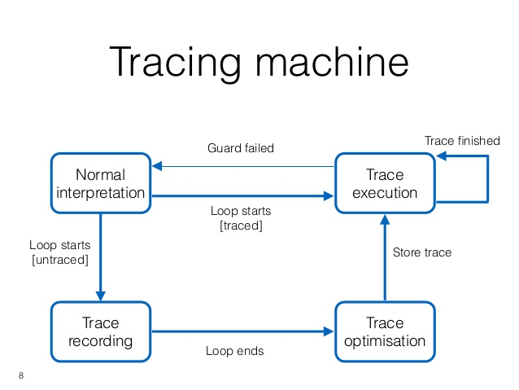

---

## SpiderMonkey: TraceMonkey

```javascript
function test(n, x, y) {
    for (var i = 0; i < n; i++) {
        add(x, y);
    }
}
```

```javascript
function test(n, x, y) {
    var i = 0; // i is an integer number
    trace_1_start:
        if (!(i < n)) // n is an integer number
            exit_trace(BRANCH);
        temp1 = x; // temp is an integer number
        temp2 = y; // temp is an integer number
        temp3 = x + y; // pure integer addition
        if (lastOperationOverflowed())
            exit_trace(OVERFLOW);
        i = i + 1; // pure integer addition
        if (lastOperationOverflowed())
            exit_trace(OVERFLOW);
        goto trace_1_start;
}
```

---

## SpiderMonkey: TraceMonkey

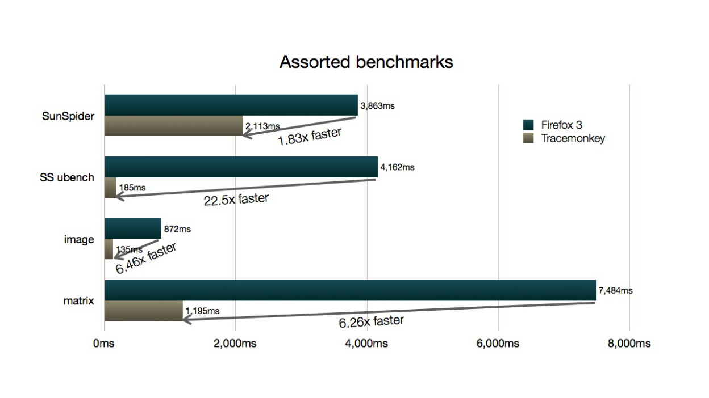

<!---->

---

## SpiderMonkey: TraceMonkey vs V8

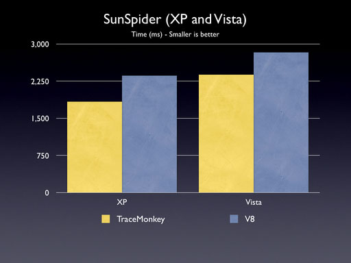

---

## SpiderMonkey: JägerMonkey


---

## SpiderMonkey: JägerMonkey + TraceMonkey

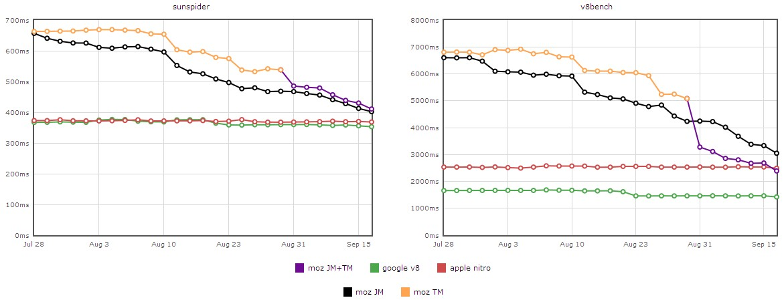

---

## SpiderMonkey

JägerMonkey + generic Type Inference (2011)

~~TraceMonkey~~

---

## SpiderMonkey: Baseline

Baseline (2013) = Interpreter + Inline Caches

```javascript
document.getElementById
```

```graph-lr
document-->hasGetElementById{"is cached?"}
hasGetElementById-->cached["cachedOffset"]
hasGetElementById-->g
g-->e
e-->t
t-->E
E-->l
l-->e2["e"]
e2-->m
m-->e3["e"]
e3-->n
n-->t2["t"]
t2-->B
B-->y
y-->I
I-->d
d-->cached
cached-->value["getValue()"]
```

---

## SpiderMonkey

Baseline

~~JägerMonkey~~

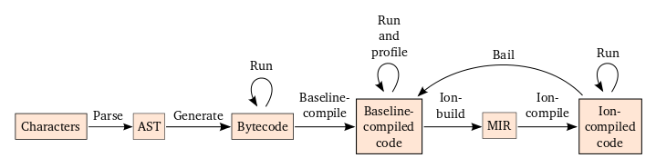

---

## SpiderMonkey: Baseline

```bash
IONFLAGS="bl-all" ./dist/bin/js --no-ion temp.js

# or just Inline Caches:

IONFLAGS="bl-ic" ./dist/bin/js --no-ion temp.js
```

```text
...
[BaselineScripts] Created BaselineScript 0x10a1f00b0 (raw 0x108b4c470) for temp.js:7
[BaselineICFallback] Fallback hit for (temp.js:7) (pc=57,line=8,uses=11,stubs=0): Compare(lt)
[BaselineIC]   Generating lt(Int32, Int32) stub
[BaselineICFallback] Fallback hit for (temp.js:7) (pc=13,line=9,uses=11,stubs=0): GetName(getgname)
[BaselineIC]   Added TypeMonitor stub 0x108dbc038 for singleton 0x109e915c0
[BaselineIC]   Generating GetName(GlobalName non-lexical) stub
[BaselineICFallback] Fallback hit for (temp.js:7) (pc=29,line=9,uses=11,stubs=0): Call(call)
[BaselineIC]   Created new TypeMonitor stub 0x108dbc0a8 for primitive type 1
[BaselineICFallback] Fallback hit for (temp.js:7) (pc=41,line=8,uses=11,stubs=0): BinaryArith(add,1,1)
[BaselineIC]   Generating add(Int32, Int32) stub
[BaselineICFallback] Fallback hit for (temp.js:7) (pc=29,line=9,uses=11,stubs=0): Call(call)
...
```

---

## SpiderMonkey: IonMonkey


---

## SpiderMonkey: IonMonkey (2012)

```bash
IONFLAGS="help" ./dist/bin/js
```

```text
usage: IONFLAGS=option,option,option,... where options can be:

  aborts     Compilation abort messages
  scripts    Compiled scripts
  mir        MIR information
  prune      Prune unused branches
  escape     Escape analysis
  alias      Alias analysis
  alias-sum  Alias analysis: shows summaries for every block
  gvn        Global Value Numbering
  licm       Loop invariant code motion
  sincos     Replace sin/cos by sincos
  sink       Sink transformation
  regalloc   Register allocation
  inline     Inlining
  snapshots  Snapshot information
  codegen    Native code generation
  bailouts   Bailouts
  caches     Inline caches
  osi        Invalidation
  safepoints Safepoints
  pools      Literal Pools (ARM only for now)
  cacheflush Instruction Cache flushes (ARM only for now)
  range      Range Analysis
  unroll     Loop unrolling
  logs       C1 and JSON visualization logging
  logs-sync  Same as logs, but flushes between each pass (sync. compiled functions only).
  profiling  Profiling-related information
  trackopts  Optimization tracking information
  all        Everything

  bl-aborts  Baseline compiler abort messages
  bl-scripts Baseline script-compilation
  bl-op      Baseline compiler detailed op-specific messages
  bl-ic      Baseline inline-cache messages
  bl-ic-fb   Baseline IC fallback stub messages
  bl-osr     Baseline IC OSR messages
  bl-bails   Baseline bailouts
  bl-dbg-osr Baseline debug mode on stack recompile messages
  bl-all     All baseline spew
```

---

## SpiderMonkey: IonMonkey (bailouts)

```bash
IONFLAGS="bailouts,bl-bails" ./dist/bin/js temp.js
```

```javascript
...
 3: function add(x, y) {
 4:     return x + y;
 5: }
...
 8: for (var i = 0; i < n; i++) {
 9:     add(x, y);
10: }
11:
12: add(x, {});
...
```

```text
...
[IonBailouts]  bailing from bytecode: nop, MIR: constant [0], LIR: goto [43]
...
[BaselineBailouts]       Resuming at pc offset 82 (op call) (line 12) of temp.js:7
[BaselineBailouts]       Bailout kind: Bailout_NonPrimitiveInput
...
[BaselineBailouts]       Resuming at pc offset 0 (op getarg) (line 4) of temp.js:3
[BaselineBailouts]       Bailout kind: Bailout_NonPrimitiveInput
...
```

---

## SpiderMonkey: IonMonkey (CFG + SSA)

```bash
IONFLAGS="logs" ./dist/bin/js
```

Spews `/tmp/ion.cfg` & `/tmp/ion.json`

---

## SpiderMonkey: IonMonkey + C1Visualizer


https://java.net/projects/c1visualizer/

---

## SpiderMonkey: IonMonkey + IRHydra


http://mrale.ph/irhydra/2/

===

# V8 (Google, 2008)


https://developers.google.com/v8/build

---

## V8

```graph-td
Source-->Preparser["Preparser<br>(syntax errors and offsets)"]

subgraph
Preparser-->Parser["Function parser (AST)"]
Parser-->FullCodegen["Full-Codegen<br>(generic native code with IC)"]
FullCodegen-->exec["(execution)"]
exec-->Parser
end
```

---

## V8: Crankshaft (2010)

```graph-td
Source==>Preparser["Preparser<br>(errors and positions)"]

subgraph
Hydrogen["Hydrogen (CFG + SSA)"]==>Lithium["Lithium (Low-level IR)"]
Lithium==>native2["(optimized native code with Bailouts)"]
end

subgraph
Parser["Function parser (AST)"]
FullCodegen["Full-Codegen<br>(Generic native code with IC)"]
end

Preparser==>Parser
Parser=="🔥 🔥 🔥"==>Hydrogen
Parser==>FullCodegen

exec["(native execution)"]

FullCodegen==>exec
native2==>exec
exec-->Parser
```

---

## V8: Crankshaft vs Full-Codegen

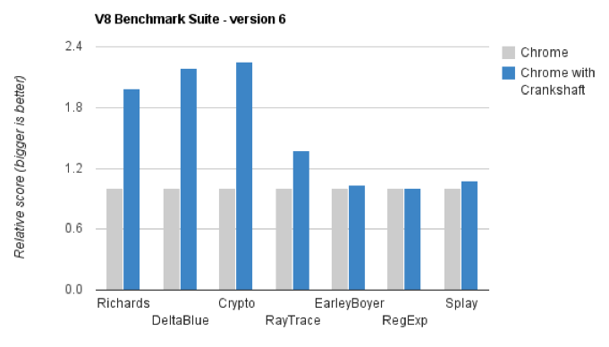

---

## V8

```bash
node --v8-options | grep trace
```

```text
  --trace_pretenuring (trace pretenuring decisions of HAllocate instructions)
  --trace_pretenuring_statistics (trace allocation site pretenuring statistics)
  --trace_ignition (trace the bytecodes executed by the ignition interpreter)
  --trace_ignition_codegen (trace the codegen of ignition interpreter bytecode handlers)
  --trace_check_elimination (trace check elimination phase)
  --trace_environment_liveness (trace liveness of local variable slots)
  --trace_hydrogen (trace generated hydrogen to file)
  --trace_hydrogen_filter (hydrogen tracing filter)
  --trace_hydrogen_stubs (trace generated hydrogen for stubs)
  --trace_hydrogen_file (trace hydrogen to given file name)
  --trace_phase (trace generated IR for specified phases)
  --trace_inlining (trace inlining decisions)
  --trace_load_elimination (trace load elimination)
  --trace_store_elimination (trace store elimination)
  --trace_alloc (trace register allocator)
  --trace_all_uses (trace all use positions)
  --trace_range (trace range analysis)
  --trace_gvn (trace global value numbering)
  --trace_representation (trace representation types)
  --trace_removable_simulates (trace removable simulates)
  --trace_escape_analysis (trace hydrogen escape analysis)
  --trace_allocation_folding (trace allocation folding)
  --trace_track_allocation_sites (trace the tracking of allocation sites)
  --trace_migration (trace object migration)
  --trace_generalization (trace map generalization)
  --trace_bce (trace array bounds check elimination)
  --trace_dead_code_elimination (trace dead code elimination)
  --trace_osr (trace on-stack replacement)
  --trace_concurrent_recompilation (track concurrent recompilation)
  --trace_turbo (trace generated TurboFan IR)
  --trace_turbo_graph (trace generated TurboFan graphs)
  --trace_turbo_cfg_file (trace turbo cfg graph (for C1 visualizer) to a given file name)
  --trace_turbo_types (trace TurboFan's types)
  --trace_turbo_scheduler (trace TurboFan's scheduler)
  --trace_turbo_reduction (trace TurboFan's various reducers)
  --trace_turbo_jt (trace TurboFan's jump threading)
  --trace_turbo_ceq (trace TurboFan's control equivalence)
  --trace_turbo_inlining (trace TurboFan inlining)
  --trace_wasm_decoder (trace decoding of wasm code)
  --trace_wasm_decode_time (trace decoding time of wasm code)
  --trace_wasm_compiler (trace compiling of wasm code)
  --trace_wasm_ast (dump AST after WASM decode)
  --trace_opt_verbose (extra verbose compilation tracing)
  --stack_trace_limit (number of stack frames to capture)
  --builtins_in_stack_traces (show built-in functions in stack traces)
  --trace_codegen (print name of functions for which code is generated)
  --trace (trace function calls)
  --trace_opt (trace lazy optimization)
  --trace_opt_stats (trace lazy optimization statistics)
  --trace_deopt (trace optimize function deoptimization)
  --trace_stub_failures (trace deoptimization of generated code stubs)
  --trace_serializer (print code serializer trace)
  --trace_js_array_abuse (trace out-of-bounds accesses to JS arrays)
  --trace_external_array_abuse (trace out-of-bounds-accesses to external arrays)
  --trace_array_abuse (trace out-of-bounds accesses to all arrays)
  --trace_debug_json (trace debugging JSON request/response)
  --max_stack_trace_source_length (maximum length of function source code printed in a stack trace.)
  --trace_gc (print one trace line following each garbage collection)
  --trace_gc_nvp (print one detailed trace line in name=value format after each garbage collection)
  --trace_gc_ignore_scavenger (do not print trace line after scavenger collection)
  --trace_idle_notification (print one trace line following each idle notification)
  --trace_idle_notification_verbose (prints the heap state used by the idle notification)
  --trace_gc_verbose (print more details following each garbage collection)
  --trace_allocation_stack_interval (print stack trace after <n> free-list allocations)
  --trace_fragmentation (report fragmentation for old space)
  --trace_fragmentation_verbose (report fragmentation for old space (detailed))
  --trace_mutator_utilization (print mutator utilization, allocation speed, gc speed)
  --trace_code_flushing (trace code flushing progress)
  --trace_incremental_marking (trace progress of the incremental marking)
  --trace_gc_object_stats (trace object counts and memory usage)
  --trace_detached_contexts (trace native contexts that are expected to be garbage collected)
  --heap_profiler_trace_objects (Dump heap object allocations/movements/size_updates)
  --trace_ic (trace inline cache state transitions)
  --trace_weak_arrays (Trace WeakFixedArray usage)
  --trace_prototype_users (Trace updates to prototype user tracking)
  --trace_parse (trace parsing and preparsing)
  --trace_sim (Trace simulator execution)
  --trace_sim_messages (Trace simulator debug messages. Implied by --trace-sim.)
  --stack_trace_on_illegal (print stack trace when an illegal exception is thrown)
  --redirect_code_traces (output deopt information and disassembly into file code-<pid>-<isolate id>.asm)
  --redirect_code_traces_to (output deopt information and disassembly into the given file)
  --trace_elements_transitions (trace elements transitions)
  --trace_creation_allocation_sites (trace the creation of allocation sites)
```

---

## V8 (bailouts)

```bash
node --trace-deopt temp.js
```

```javascript
...
 3: function add(x, y) {
 4:     return x + y;
 5: }
...
 8: for (var i = 0; i < n; i++) {
 9:     add(x, y);
10: }
11:
12: add(x, {});
...
```

```text
...
[deoptimizing (DEOPT eager): begin 0x2120580c8509 <JS Function add (SharedFunctionInfo 0x7ce389530e1)> (opt #0) @3, FP to SP delta: 24]
            ;;; deoptimize at 111: not a Smi
...
```

---

## V8 (bailouts-2; CFG + SSA)

```bash
node --trace-deopt \
     --trace-hydrogen \
     --code-comments \
     --hydrogen-track-positions \
     --redirect-code-traces \
     --redirect-code-traces-to=code.asm \
     temp.js
```

Spews `code.asm` and `hydrogen-123-456.cfg` in current folder.

---

## V8 + IRHydra


---

## V8: The Future (?)

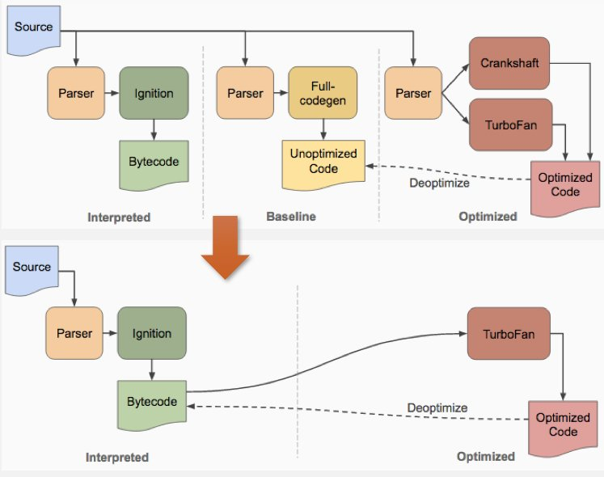

===

# JavaScriptCore

http://trac.webkit.org/wiki/JavaScriptCore

---

## JSC: Three-tier model

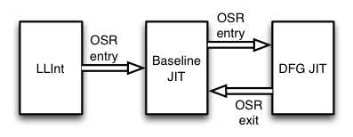

---

## JSC: Data-flow graph (DFG) JIT

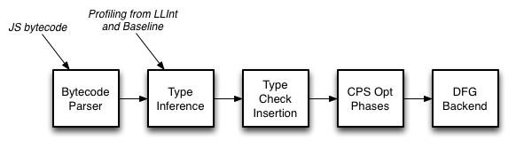

---

## JSC: Benchmarks (three-tier)

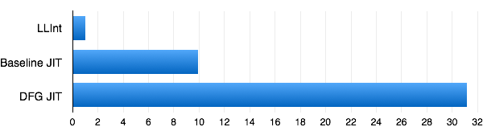

---

## JSC: Faster-than-light (FTL) JIT

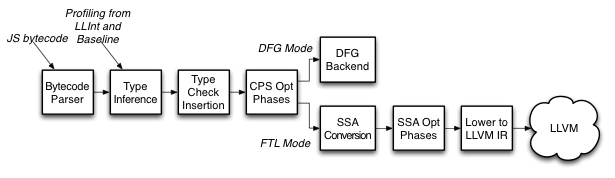

---

## JSC: Four-tier model

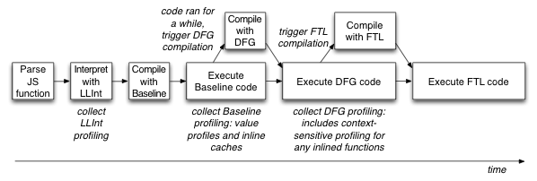

---

## JSC: Benchmarks (four-tier)

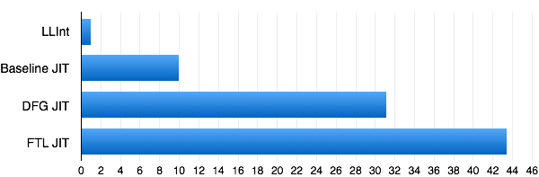

---

## JSC: Dumps

```bash
./jsc --options
```

```text
...
dumpSourceAtDFGTime=false   ... dumps source code of JS function being DFG compiled
dumpBytecodeAtDFGTime=false   ... dumps bytecode of JS function being DFG compiled
dumpGraphAfterParsing=false
dumpGraphAtEachPhase=false
dumpDFGGraphAtEachPhase=false   ... dumps the DFG graph at each phase DFG of complitaion (note this excludes DFG graphs during FTL compilation)
dumpDFGFTLGraphAtEachPhase=false   ... dumps the DFG graph at each phase DFG of complitaion when compiling FTL code
...
```

---

## JSC: CFG + SSA

```bash
./jsc --dumpGraphAfterParsing=true
```

```text
Block #0 (bc#0): (OSR target)
  Execution count: 1.000000
  Predecessors:
  Successors:
  States: StructuresAreWatched, CurrentlyCFAUnreachable
  Vars Before: <empty>
  Intersected Vars Before: arg2:(DoubleimpurenanTopEmpty, TOP, TOP) arg1:(DoubleimpurenanTopEmpty, TOP, TOP) arg0:(DoubleimpurenanTopEmpty, TOP, TOP) loc0:(DoubleimpurenanTopEmty, TOP, TOP) loc1:(DoubleimpurenanTopEmpty, TOP, TOP) loc2:(DoubleimpurenanTopEmpty, TOP, TOP) loc3:(DoubleimpurenanTopEmpty, TOP, TOP)
  Var Links:
   0:< 1:->     SetArgument(this(a), W:SideState, bc#0)  predicting None
   1:< 1:->     SetArgument(arg1(B~/FlushedJSValue), W:SideState, bc#0)  predicting None
   2:< 1:->     SetArgument(arg2(C~/FlushedJSValue), W:SideState, bc#0)  predicting None
   3:< 1:->     JSConstant(JS|PureInt, Undefined, bc#0)
   4:<!0:->     MovHint(Check:Untyped:@3, MustGen, loc0, W:SideState, ClobbersExit, bc#0)
   5:< 1:->     SetLocal(Check:Untyped:@3, loc0(D~/FlushedJSValue), W:Stack(-1), bc#0, ExitInvalid)  predicting None
   6:<!0:->     MovHint(Check:Untyped:@3, MustGen, loc1, W:SideState, ClobbersExit, bc#0, ExitInvalid)
   7:< 1:->     SetLocal(Check:Untyped:@3, loc1(E~/FlushedJSValue), W:Stack(-2), bc#0, ExitInvalid)  predicting None
   8:<!0:->     MovHint(Check:Untyped:@3, MustGen, loc2, W:SideState, ClobbersExit, bc#0, ExitInvalid)
   9:< 1:->     SetLocal(Check:Untyped:@3, loc2(F~/FlushedJSValue), W:Stack(-3), bc#0, ExitInvalid)  predicting None
  10:< 1:->     JSConstant(JS|PureInt, Weak:Cell: 01441BE0 (%CW:Function), bc#1)
  11:< 1:->     JSConstant(JS|PureInt, Weak:Cell: 0145FFC0 (%BL:JSGlobalLexicalEnvironment), bc#1)
  12:<!0:->     MovHint(Check:Untyped:@11, MustGen, loc0, W:SideState, ClobbersExit, bc#1)
  13:< 1:->     SetLocal(Check:Untyped:@11, loc0(G~/FlushedJSValue), W:Stack(-1), bc#1, exit: bc#3)  predicting None
  14:<!0:->     MovHint(Check:Untyped:@11, MustGen, loc1, W:SideState, ClobbersExit, bc#3)
  15:< 1:->     SetLocal(Check:Untyped:@11, loc1(H~/FlushedJSValue), W:Stack(-2), bc#3, exit: bc#6)  predicting None
  16:<!0:->     GetLocal(JS|MustGen|PureInt, arg1(B~/FlushedJSValue), R:Stack(5), bc#6)  predicting None
  17:<!0:->     GetLocal(JS|MustGen|PureInt, arg2(C~/FlushedJSValue), R:Stack(6), bc#6)  predicting None
  18:<!0:->     ValueAdd(Check:Untyped:@16, Check:Untyped:@17, JS|MustGen|PureInt, R:World, W:Heap, Exits, ClobbersExit, bc#6)
  19:<!0:->     MovHint(Check:Untyped:@18, MustGen, loc3, W:SideState, ClobbersExit, bc#6, ExitInvalid)
  20:< 1:->     SetLocal(Check:Untyped:@18, loc3(I~/FlushedJSValue), W:Stack(-4), bc#6, exit: bc#11)  predicting None
  21:<!0:->     Return(Check:Untyped:@18, MustGen, W:SideState, Exits, bc#11)
  22:<!0:->     Flush(MustGen, arg2(C~/FlushedJSValue), R:Stack(6), W:SideState, bc#11)  predicting None
  23:<!0:->     Flush(MustGen, arg1(B~/FlushedJSValue), R:Stack(5), W:SideState, bc#11)  predicting None
```

===

# ChakraCore


---

## ChakraCore: Bailouts

```javascript
function add(x, y) {
    return x + y;
}

for (var i = 0; i < 1000000; i++) {
    add(10, 20);
}

add(10, {});
```

```bash
./ch -Trace:Bailout temp.js
```

<pre style="font-style: italic">(this space is intentionally left blank)</pre>

---

## ChakraCore: Bailouts

```javascript
function abs(x) {
    if (x >= 0) {
        return x;
    } else {
        return -x;
    }
}

for (var i = 0; i < 100000; i++) {
    abs(10);
}

abs('10');
```

```bash
./ch -Trace:Bailout temp.js
```

```text
BailOut: function: abs ( (#1.1), #2) offset: #0000 Opcode: FromVar Kind: BailOutIntOnly
```

---

## ChakraCore: CFG + SSA

```bash
./ch -Dump:FGBuild temp.js
```

```text
-----------------------------------------------------------------------------
************   IR after FGBuild (FullJit)  ************
-----------------------------------------------------------------------------
Function abs ( (#1.1), #2)                        Instr Count:21

                       FunctionEntry                                          #
...
BLOCK 2: In(0) Out(3)

$L3:                                                                          #0011
  Line   7: return -x;
  Col    9: ^
                       StatementBoundary  #2                                  #0011
    s0.var          =  Neg_A          s3.var                                  #0011
                       Br             $L1                                     #0014
...
```

===

# AreWeFastYet? (.com)

===

# Yaaay, we did it!..

## P.S. I didn't cover much, but :)